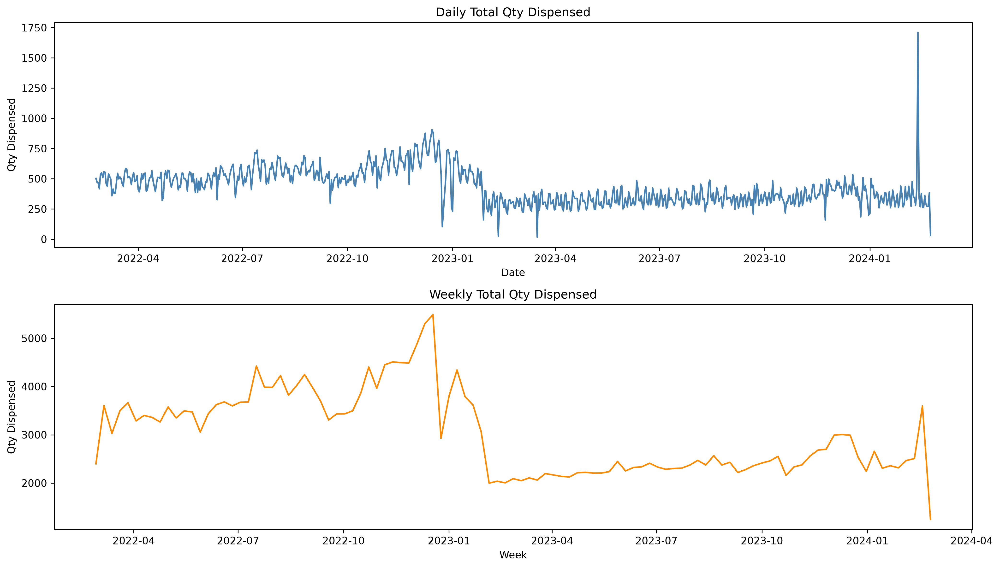
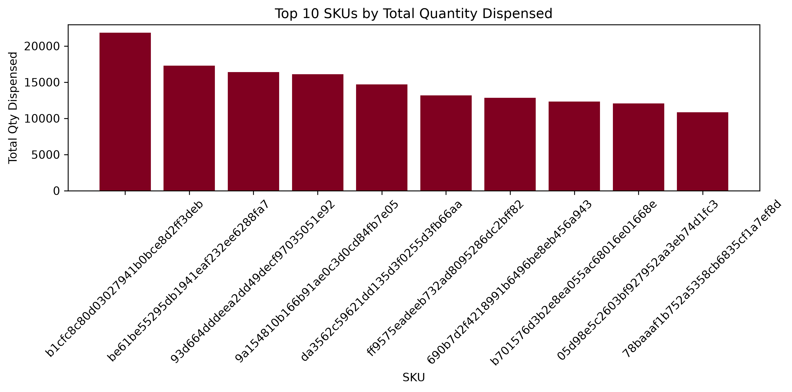
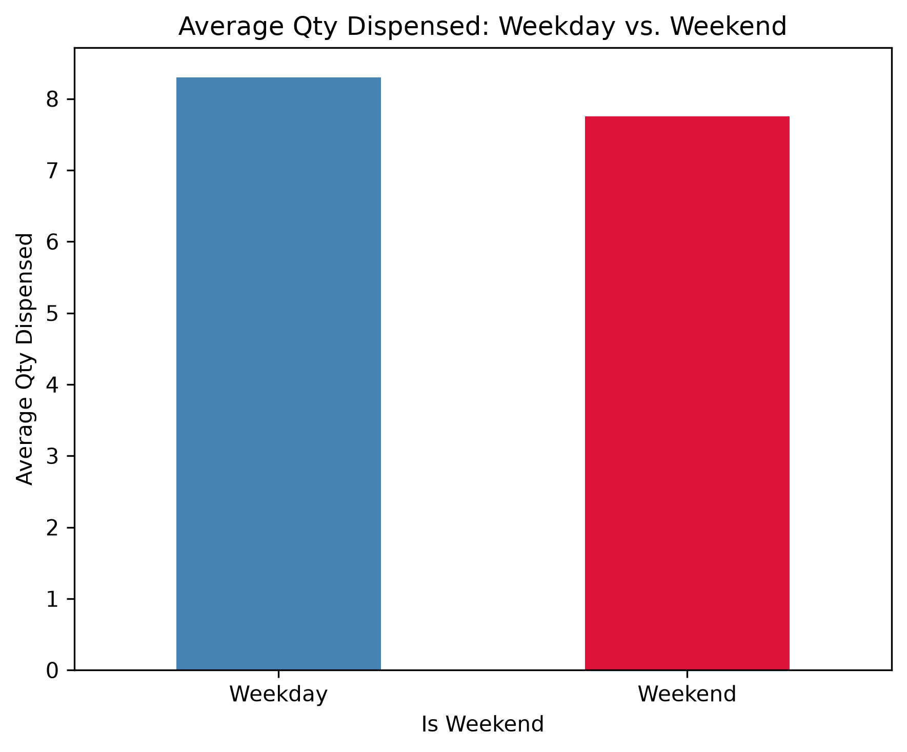
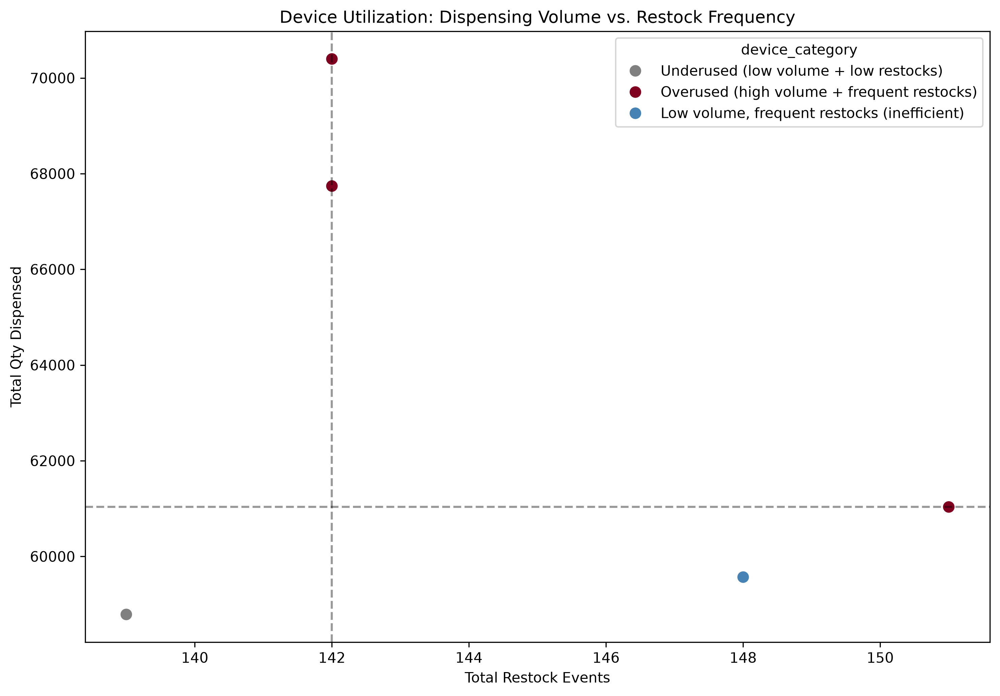
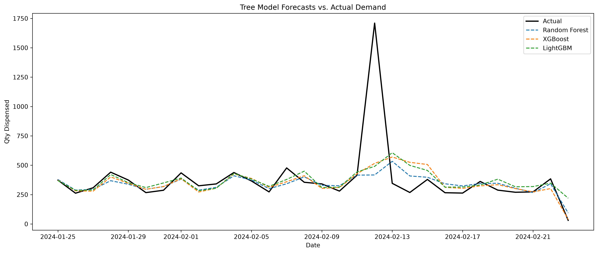
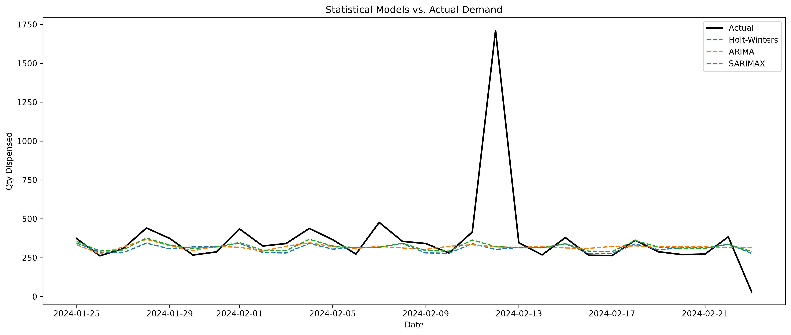
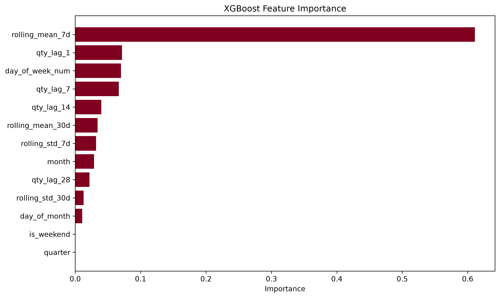

# Analysis — Vending Machine Demand & Inventory Planning

[Project Introduction](README.md) · [Technical Documentation](readme_tech.md)

**Educational, AI-assisted analysis:** Claude generated the analytical work and recommendations. This document summarizes reported outputs; it does not establish independently reproduced results or implemented operational improvements.

## Business Problem

Restocking on a fixed schedule can lead to unnecessary visits at slower devices and insufficient inventory at faster devices. The project explores three questions:

1. How does dispensing demand vary over time, across SKUs, and across devices?
2. Which forecasting approaches perform best on the reported evaluation metrics?
3. How could demand variability inform inventory buffers and replenishment priorities?

The intended business application is proactive replenishment. Reduced costs, fewer stockouts, and improved route efficiency are proposed outcomes—not measured achievements of this project.

## Reported Forecasting Results

The following values are taken from [`model_comparison_results.csv`](data/model_comparison_results.csv). MAE and RMSE are expressed in the forecast target's units; MAPE is a percentage. Lower values indicate smaller errors on the corresponding metric.

| Model | MAE | RMSE | MAPE (%) |
| --- | ---: | ---: | ---: |
| XGBoost | 91.28 | 231.41 | 18.83 |
| LightGBM | 100.08 | 238.53 | 39.37 |
| Random Forest | 87.72 | 243.91 | 22.21 |
| Seasonal Naive (7-day) | 85.70 | 256.57 | 36.69 |
| SARIMAX(1,1,1)(1,1,1,7) | 93.65 | 262.52 | 41.55 |
| ARIMA(7,1,1) | 103.60 | 265.38 | 46.79 |
| Holt-Winters | 99.96 | 266.81 | 41.80 |
| Naive (last value) | 108.60 | 267.50 | 48.45 |

**XGBoost has the lowest reported MAPE and RMSE; Seasonal Naive has the lowest MAE.** Model preference therefore depends on the evaluation metric and business objective. An 18.83% MAPE should not be described as “81.17% accuracy.”

The presentation describes these as holdout results. The exported metrics alone do not establish the train/test dates, forecast horizon, tuning procedure, or whether all models used an identical evaluation window. These results have not been independently reproduced for this README.

## Interpretation & Operational Proposals

### Demand patterns and anomalies

The project includes trend, seasonal, and rolling-demand outputs. Its presentation calls for investigating an unusual mid-February demand spike with field operations to distinguish a real business event from a telemetry issue. An unexplained spike should remain an investigation item rather than receive an assumed explanation.

### Predictive features

The deck reports approximately 62% XGBoost importance for the seven-day rolling mean, followed by lagged demand and calendar features. This describes the fitted model's feature-importance measure; it does not establish causation. Confirming that rolling features exclude the prediction day's target is essential before accepting the performance results.

### Inventory planning

[`sku_safety_stock_reorder_points.csv`](data/sku_safety_stock_reorder_points.csv) contains estimates for **82 SKUs**. The deck describes a **95% service-level assumption**, a **Z value of 1.65**, and an **estimated two-day lead time**. These assumptions are planning inputs, not verified supplier performance or achieved service levels.

Before implementation, inventory estimates would need validation against actual lead times, available stock, machine capacity, pack sizes, stockout history, and the chosen service-level definition. Dispensing alone may understate demand when products are unavailable.

### Device replenishment

[`device_restock_schedule.csv`](data/device_restock_schedule.csv) contains **five devices** and proposed review frequencies. The presentation also includes illustrative facilities, dispatch times, and batch sizes. These should be treated as operational scenarios pending validation, rather than confirmed locations or optimized routes.

The deck's classification table accounts for four devices, while the schedule CSV lists five. The deck and CSV also differ in some replenishment/review intervals. These differences should be reconciled before using the plan operationally. A review interval is not necessarily a restock interval.

## Limitations & Items Requiring Validation

- **Reproducibility:** Supporting charts and exported results do not replace the full forecasting code, source dataset, dependency versions, and evaluation configuration.
- **Time-series validation:** Verify chronological splits, consistent evaluation windows, and a clearly defined forecast horizon. Ensure lag and rolling features use only information available at prediction time.
- **Missing lag features:** The missing-feature summary contains 28 rows with early-date lag gaps. Such gaps can arise naturally at the beginning of a series. The deck's claim that missing windows resulted from offline maintenance and were imputed requires supporting code and operational evidence.
- **Correlation:** The deck reports a strong negative dispensing/restock correlation. Correlation alone cannot confirm a reactive restocking policy or explain its cause.
- **Stockouts and routing:** Volume-based categories cannot prove that stockout risk is absent. Route recommendations need location, travel-time, capacity, and service-window data.
- **Business impact:** No measured cost savings, stockout reduction, or production deployment is established by the supplied artifacts.
- **Data provenance:** The supplied outputs do not fully document the original dataset's source, collection process, or redistribution terms. Confirm these before publishing raw data.

## Supporting Visuals

### Demand over time

### SKU turnover

### Weekday and weekend behavior

A difference in average dispensing does not, by itself, establish how many delivery routes are needed. Capacity, inventory, and service constraints also matter.

### Device utilization

### Forecast comparison

### Model feature importance

## Recommended Next Steps

1. Investigate the unusual demand spike using operational records.
2. Reconcile the presentation's device counts and schedules with the exported CSV.
3. Validate lead times, capacity, stock availability, and service-level assumptions.
4. Independently reproduce model evaluation before adopting forecasts.
5. Pilot a replenishment policy and compare stockouts, service levels, visits, and costs against a baseline.
